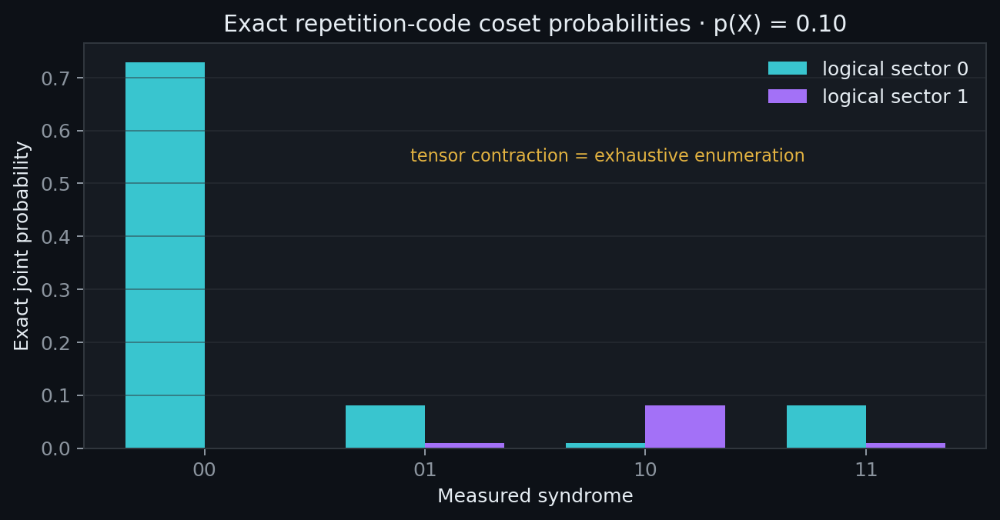
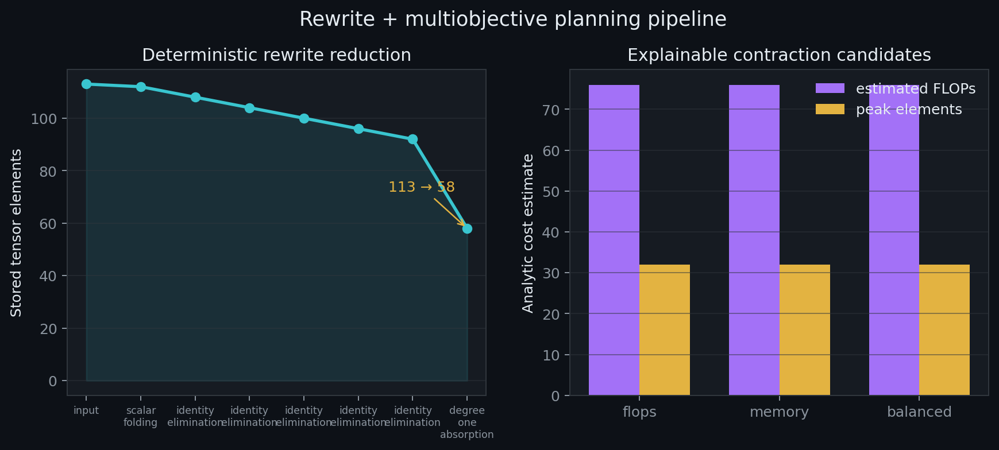
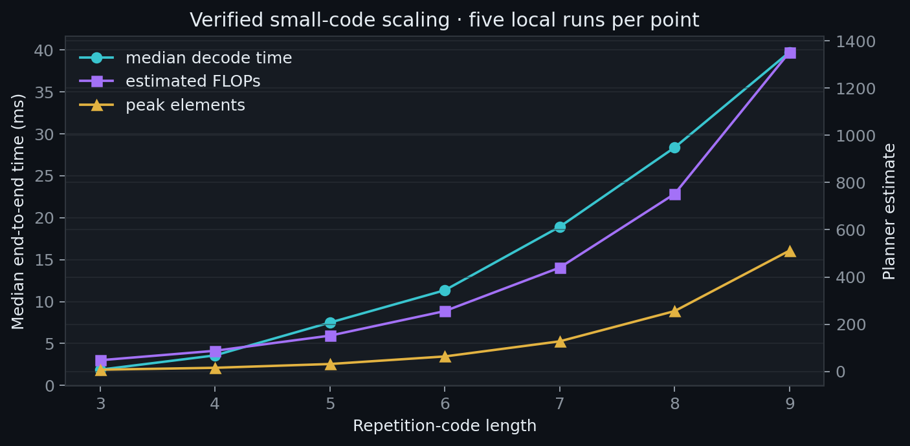

# tensorcontract

`tensorcontract` is an early research implementation of a backend-independent
tensor-network IR, deterministic graph rewrites, hardware-aware contraction
planning, and exact small-code QEC decoding. It runs without CUDA; NumPy is the
correctness backend.

<p align="center">
  
</p>

<p align="center"><em>Tensor-network sector probabilities agree with exhaustive enumeration.</em></p>

## Working vertical slice

The current decoder constructs a tensor hypergraph for a classical repetition
code under independent Pauli noise, conditions parity factors on a syndrome,
and contracts each of the two logical sectors. It then verifies both sector
probabilities against exhaustive error enumeration. All reported repetition
results are exact up to floating-point rounding; no threshold or asymptotic
performance claim is made.

```bash
cd /home/raf/adap/tensorcontract
PYTHONPATH=src python3 examples/repetition_decode.py
PYTHONPATH=src python3 -m pytest
```

The example prints a deterministic rewrite trace, all candidate planning
reports, the selected multiobjective plan, and batched syndrome metrics.

## Visual reports

<p align="center">
  
</p>

<p align="center">
  
</p>

Regenerate these images from the implementation with:

```bash
PYTHONPATH=src python3 examples/generate_visualizations.py
```

The timing panel reports five local CPU runs per point and must not be treated
as a cross-machine benchmark. FLOPs and peak elements are planner estimates.

## Implemented

- Typed named-index/hyperedge IR and tensor kinds for dense, diagonal, sparse,
  parity, copy/delta, permutation, stabilizer, Pauli-noise, identity, and scalar
  tensors.
- Open-index-preserving NumPy pairwise execution.
- Conservative scalar-folding, identity-elimination, and degree-one-absorption
  rewrites, each with preconditions and before/after storage estimates.
- Deterministic FLOP-, memory-, and balanced-greedy candidates; combined
  FLOP/peak-size selection, byte-traffic and arithmetic-intensity estimates,
  contraction shape classification, and hard intermediate/memory constraints.
- Exact repetition-code coset probabilities and batch statistics.

## Scientific status and limitations

This milestone is exact only for the implemented small repetition-code model
and exhaustive verifier. Planner costs are analytic estimates, not measured GPU
metrics. The candidate generator is deterministic greedy search (the `beam_width`
field is reserved for the next planner iteration). Slicing, PyTorch execution,
optional optimizer adapters, full correlated Pauli factors, and surface-code
construction are not implemented yet. The additional rewrite-rule names in the
product roadmap are likewise future work; this README does not claim them.

The code intentionally separates the tensor IR, rewrite engine, planner,
backend, and QEC construction. A future stabilizer design layer must validate
binary symplectic commutation independently; contraction output alone will not
be treated as proof that a construction is a valid quantum code.

## Next milestones

1. Add a validated CSS/stabilizer algebra layer and a small planar surface-code
   decoding network with exhaustive checks.
2. Add PyTorch CPU/CUDA execution, slicing, repeated-syndrome reuse, and measured
   peak-memory/device metrics.
3. Expand the rewrite system and beam-search planner, then add `opt_einsum` and
   optional `cotengra`/cuTensorNet adapters plus representative benchmarks.
